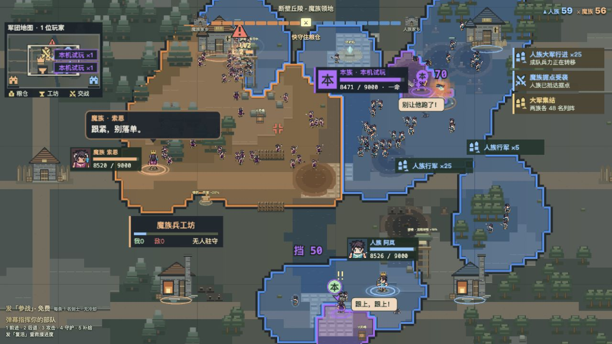

# Interactive Live Game Kit · 互动直播游戏工具包

**让观众用弹幕玩游戏，让 AI 在直播间里解说和接话。**

**简体中文** · [English](README.md)

观众发一句「参战」，战场上就出现一名属于他的士兵；再发「后退」，这支队伍就往回撤。有人送来援军，AI 主持人可以回应；有人想单干，就用自己的头像当将军，建立一个新阵营。

这个仓库把这样的直播间拆开给你：**一个能在电脑上试玩的游戏、接收弹幕和礼物的代码，以及从做游戏到接入直播的教程。** 你可以沿用示例，也可以和 AI 编程助手一起改成守塔、竞速或其他玩法。



## 下载后能做什么

- **先自己玩。** 在本机输入测试弹幕，试派兵、指挥、礼物和多人阵营，不需要直播账号，也不用充值。
- **加一个会说话的主持人。** 接上模型服务和语音，再装一个有使用许可的 Live2D 角色，让她解说战场、回应观众。
- **接到自己的 B站直播间。** 配置平台提供的授权，让真实弹幕和礼物影响游戏，用 OBS 把游戏画面与声音播出去。
- **做自己的版本。** 改玩法、人物、互动指令和礼物效果；教程也记录了怎样把这些需求交给 AI 编程助手逐步实现。

示例游戏叫「人魔争霸」：人族、魔族和观众自建的阵营争夺战场。首领倒下后，家里的下一位接着来，王冠也接着往头上叠。这个游戏是起点；工具包的用途是帮你搭建自己的互动直播。

## 第一次来，从这里开始

**[下载、安装并派出第一名士兵 →](examples/whitebridge/README.zh-CN.md)**

这篇从下载 ZIP、打开终端开始写。不需要先读源码，也不需要先申请平台。

已经熟悉 Node.js？安装 24.11 或更新的 24.x 版本，在项目文件夹中运行：

```sh
npm ci
npm start
```

打开 [http://127.0.0.1:4391/](http://127.0.0.1:4391/)，点击「继续」，在底部测试弹幕框发送 `参战`。停止试玩时，在启动它的终端按 `Ctrl+C`。

## 按你想做的事往下走

| 我想…… | 看这里 |
| --- | --- |
| 先体验这个游戏 | [试玩与操作](examples/whitebridge/README.zh-CN.md) |
| 从一个想法做出自己的互动玩法 | [和 AI 一起开发](docs/zh-CN/WORKFLOW.md) |
| 让右下角的人物动起来、说话 | [主持人、语音与记忆](docs/zh-CN/AI-AND-MEMORY.md) |
| 把弹幕接进来，再把游戏播出去 | [B站与 OBS](docs/zh-CN/BILIBILI-AND-OBS.md) |
| 改成另一种游戏 | [改造示例](docs/zh-CN/REPLACE-EXAMPLE.md) |
| 找到某个功能的源码 | [代码地图](docs/zh-CN/ARCHITECTURE.md) |
| 看这个项目是怎么做出来的 | [开发经过](docs/zh-CN/BUILD-STORY.md) |

## 开始前需要知道的几件事

本地试玩包含战场、像素角色、音乐和音效。**视频里的魔女模型需要自行取得并安装**；AI 解说需要模型服务，语音需要另行配置。它们都有单独的安装说明，试玩游戏不依赖这些服务。

B站接入需要你自己的直播间、开发者和应用授权。小红书、YouTube、Twitch 暂不能按本教程直接接通弹幕与礼物。英文教程已经提供，游戏界面目前主要是中文。已验证环境与测试方法见[运行检查](docs/zh-CN/VALIDATION.md)。

代码和教程采用 [MIT 许可](LICENSE)，可以修改和使用；角色素材、音频、Live2D 模型各有自己的[使用许可](docs/zh-CN/THIRD_PARTY_NOTICES.md)。

[参与改进](docs/zh-CN/CONTRIBUTING.md) · [配置与数据管理](docs/zh-CN/SECURITY.md) · [介绍你的改版](docs/zh-CN/SHARING.md) · [其他语言](docs/LANGUAGES.md)
